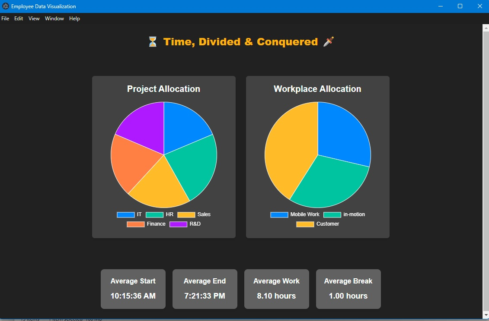

# Employee Data Visualization

A desktop application built with **Electron**, **React**, **TypeScript**, and **Tailwind CSS** for visualizing employee time tracking data. The app fetches randomized time tracking entries from an API and displays them using interactive **Pie Charts**. Averages for start/end time, work duration, and break duration are also displayed in cards below the charts.

---

## Demo / Screenshot



---

## Technologies Used

- **Electron** – Cross-platform desktop app framework
- **React** – UI library
- **TypeScript** – Type-safe JavaScript
- **Tailwind CSS** – Utility-first styling
- **Chart.js / react-chartjs-2** – Pie charts visualization
- **Jest / React Testing Library** – Unit testing

---

## Features

- Interactive Pie Charts showing **Project Allocation** and **Workplace Allocation**
- Average cards for start time, end time, work duration, and break duration
- Responsive layout for small and large screens
- Dark theme with color-coded charts
- Desktop notifications when new data is loaded
- Fully typed TypeScript codebase

---

## Folder Structure

```bash
.
├─ /assets           
│   ├─ /screenshots
│   │   ├─ in-motion.jpg 
│   │   └─ in-motion-responsive.jpg      
├─ /electron            
│   ├─ index.ts
│   ├─ preload.ts
│   └─ tsconfig.json
├─ /src                 
│   ├─ /api
│   │   ├─ api.ts
│   │   ├─ base.ts
│   │   ├─ common.ts
│   │   ├─ configuration.ts
│   │   └─ index.ts
│   ├─ /components
│   │   ├─ Card.tsx
│   │   ├─ Chart.tsx
│   │   └─ Dashboard.tsx
│   ├─ /hooks
│   │   └─ useTimeChanges.ts
│   ├─ /tests               
│   │   ├─ /components
│   │   │   ├─ Card.test.tsx
│   │   │   ├─ Chart.test.tsx
│   │   │   └─ Dashboard.test.tsx
│   │   ├─ /hooks
│   │   │   └─ useTimeChanges.test.ts
│   │   └─ /utils
│   │       └─ timeChangesUtils.test.ts
│   └─ /utils
│   │    └─ timeChangesUtils.ts
│   │
│   ├─ App.tsx
│   ├─ index.css
│   ├─ index.html
│   └─ main.tsx
├─ .eslintrc.json
├─ .gitignore
├─ .prettierrc
├─ .LICENSE.md
├─ README.md
└─ forge.config.js
```

## Quick Start

### Clone & Install

```bash
git clone https://github.com/agaribovic/Employee-Data-Visualization.git
cd employee-data-visualization
npm install
```
---

### Configure API Base URL

After setting up OpenAPI, ensure the following configuration is applied:

1. **Set the API base URL** in `common.ts`:

```ts
export const DUMMY_BASE_URL = `https://api.dummy.in-lotion.de`;
```

2. **Verify the API endpoint path in** in `api.ts`:

```ts
const localVarPath = `/api/time-changes`;
```

---

## Environment Modes:

- Development: npm run dev
- Production: npm run build && npm run start:prod

---

### Run in Development

```bash
npm run dev
```

- Electron loads the React app from http://localhost:3000
- Auto-refresh on file changes
- DevTools are open (optional)

### Run Tests
```bash
npm run test
```

- Uses Jest and React Testing Library

### Build Production App

```bash
npm run build
```

### Run Production

```bash
npm run start:prod
```

- Electron loads compiled frontend from /dist-vite/index.html
- DevTools are disabled

### Create Windows Executable (.exe)

```bash
npm run make
```

- The .exe is located in /out/make/squirrel.windows/x64/
- Portable, no installer required


### Windows Executable (.exe)

A portable Windows executable of the **Employee Data Visualization App** is available.  
No installer is required — simply download and launch the app directly.

[Download Employee Data Visualization App](https://github.com/agaribovic/Employee-Data-Visualization/releases/latest/download/Employee.Data.Visualization.App.0.6.0.exe)


